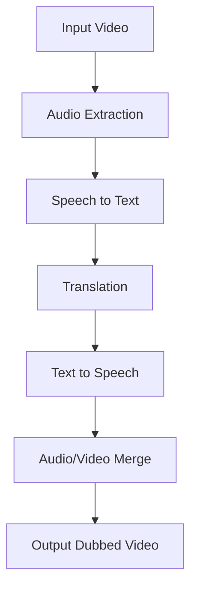

# Video Dubbing Pipeline


A professional, fully automated pipeline for translating and dubbing video content into multiple languages.

## Features

- **Audio Extraction**: Cleanly separate audio from video sources.
- **Translation**: Accurate text translation using state-of-the-art models.
- **TTS Generation**: High-quality text-to-speech generation.
- **Video Assembly**: Merge translated audio back into the original video with precise syncing.

## Architecture



## Quick Start

1. Install dependencies:
   ```bash
   pip install -r requirements.txt
   ```

2. Set up environment variables:
   ```bash
   cp .env.example .env
   # Edit .env with your API keys
   ```

3. Run the pipeline:
   ```bash
   python src/pipeline.py
   ```

## Testing

Run tests with pytest:
```bash
pytest tests/
```

## License

This project is licensed under the MIT License.
